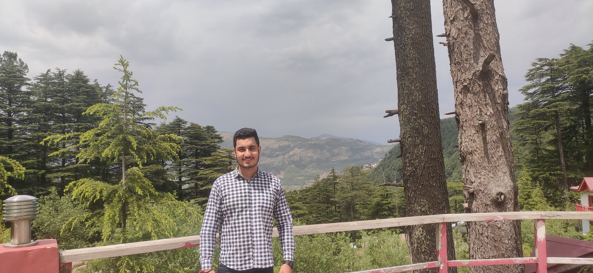

### Hi There 👋

 This is Anmol , an 2nd Year Engineering Student at University Institute of Engineering and Technology (UIET), Punjab University Chandigarh. I love ⚡ Programming in C++ mainly as it involves problem solving ,and I Love to be Front-End developer and passionate in developing UI of website as well . 

<!-- <h2>🌱 I’m currently learning </h2>
- React Native -->
<h2>🌱 My Tech Stacks :  </h2>
- React 
- Next Js
- Javascript 
- AJAX
- J query
- Next Auth
- Bootstrap 
- Reactstrap
- Tailwind Css
- Redux
- React Hooks
- Firebase
  
  <h2>⚡ Fun fact:</h2>
  
  I love to Spend my Free Time with My Rubiks Cube and Playing Chess with Sister.
  
  
  <h2 align="center">📈 Github Stats</h2>

  

<!--   ## &#x1f4c8; My GitHub Stats

 -->
 
 

<h2> 📫<b>How to reach me:</b>  </h2>
Email: <a href="mailto:anmolreshi@gmail.com">anmolreshi@gmail.com </a>
Linkedin :<a href="https://www.linkedin.com/in/anmolreshi/">Anmol Reshi</a>

<!--
**Anmolreshi/Anmolreshi** is a ✨ _special_ ✨ repository because its `README.md` (this file) appears on your GitHub profile.

Here are some ideas to get you started:  
- 🔭 I’m currently working on ...
- 🌱 I’m currently learning ...
- 👯 I’m looking to collaborate on ...
- 🤔 I’m looking for help with ...
- 💬 Ask me about ...
- 📫 How to reach me: ...
- 😄 Pronouns: ...
- ⚡ Fun fact: ...
-->
