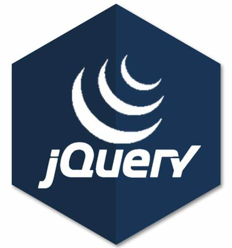

### Hi There 👋
This is Anmol , an 2nd Year Engineering Student at University Institute of Engineering and Technology (UIET), Punjab University Chandigarh. I love ⚡ Programming in C++ mainly as it involves problem solving ,and I Love to be Front-End developer and passionate in developing UI of website as well .

<b>My Tech Stacks :</b>  

📫 <b>How to reach me:</b>  
Email: anmolreshi@gmail.com

<!--
**Anmolreshi/Anmolreshi** is a ✨ _special_ ✨ repository because its `README.md` (this file) appears on your GitHub profile.

Here are some ideas to get you started:  
- 🔭 I’m currently working on ...
- 🌱 I’m currently learning ...
- 👯 I’m looking to collaborate on ...
- 🤔 I’m looking for help with ...
- 💬 Ask me about ...
- 📫 How to reach me: ...
- 😄 Pronouns: ...
- ⚡ Fun fact: ...
-->
