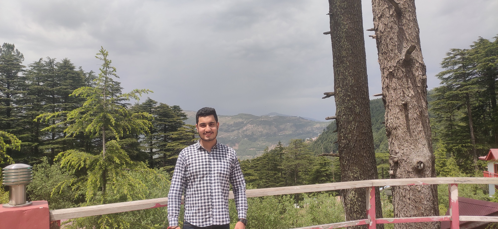

### Anmol Reshi 
<!--  -->
## 🧐 About
Software Engineer | Community Builder | Innovator

From crafting scalable web solutions to empowering global developer communities, I thrive at the intersection of technology and collaboration. With 3.5+ years of experience in front-end development and API integration, I specialize in building user-centric, mobile-responsive applications that deliver results. At Incedo Inc., I’ve played a pivotal role in projects , enhancing business communication through innovative features and reducing bugs by 85% across four distinct environments.

Beyond the code, I’m the driving force behind Hack The Mountains, an international hackathon that has brought together over 12,000 developers to learn, create, and innovate. As a founding member of Sudan’s Technocrats Foundation, I’ve helped organize 50+ tech events, impacting 20,000+ students globally. For me, building a community is as rewarding as building software.

Fueled by curiosity and a passion for problem-solving, I constantly explore new technologies like Angular, React, and AWS to elevate my craft. My journey is about more than just delivering projects—it's about fostering connections, inspiring creativity, and making a difference.

When I’m not writing code or organizing events, you’ll find me diving into thought-provoking conversations, exploring nature, or brainstorming the next big idea. Let’s connect to create something extraordinary together!
<h2>🌱  What I Work on   </h2>
- React 
- Next Js
- Angular
- Javascript 
- AJAX
- J query
- Next Auth
- Next Js
- Bootstrap 
- Reactstrap
- Tailwind Css
- Redux
- React Hooks
- Firebase
  
  <h2>⚡ Fun fact</h2>
  
  I love to Spend my Free Time with My Rubiks Cube and Playing Chess with Sister.
  
  <h2> 👯 Acheivements </h2>
- Founding Member @sudans Tech  
- Organiser at @Hack The Mountains 3.0 , @GirlScript , @Himalayan Foundadation , @Rotaract Chandigarah Himalayan  

  
<h2>💬 <b>How to reach me:</b>  </h2>
Email: <a href="mailto:anmolreshi@gmail.com">anmolreshi@gmail.com </a> 
Linkedin :<a href="https://www.linkedin.com/in/anmolreshi/">Anmol Reshi</a> 
Blogs : <a href="https://medium.com/@anmolreshi">Anmol Reshi</a> 

<!--
**Anmolreshi/Anmolreshi** is a ✨ _special_ ✨ repository because its `README.md` (this file) appears on your GitHub profile.

Here are some ideas to get you started:  
- 🔭 I’m currently working on ...
- 🌱 I’m currently learning ...
- 👯 I’m looking to collaborate on ...
- 🤔 I’m looking for help with ...
- 💬 Ask me about ...
- 📫 How to reach me: ...
- 😄 Pronouns: ...
- ⚡ Fun fact: ...
-->
